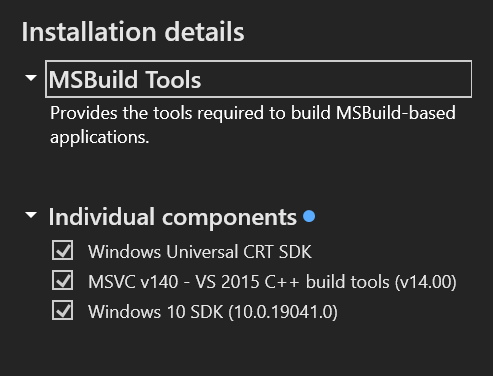

# AutoYTPoo

## What It Does

- Generates a text description of a strange/humorous image using LLaMA.
- Generates a voiceover script describing that image using LLaMA.
- Enhances the text description and uses Stable Diffusion to generate the image.
- Generates the voiceover audio using Coqui TTS.
- Stitches the image and audio into a video using ffmpeg.
- Generates a title for the video using BLIP.
- ~~Uploads the video to YouTube.~~ **WIP**

## Prerequisites

- [Git for Windows](https://gitforwindows.org/)
- [Conda](https://docs.conda.io/projects/miniconda/en/latest/)
- [MSVC Build Tools](https://visualstudio.microsoft.com/visual-cpp-build-tools/)
- [ffmpeg](https://www.gyan.dev/ffmpeg/builds/ffmpeg-git-full.7z) (in this dir or on your `PATH`)

## Models

Clone these to the `./models` directory in this working copy.

- [stable-diffusion-v1-5](https://huggingface.co/runwayml/stable-diffusion-v1-5)
- [Llama-2-7b-chat-hf](https://huggingface.co/meta-llama/Llama-2-7b-chat-hf)
- [promptgen-lexart](https://huggingface.co/AUTOMATIC/promptgen-lexart)
- [blip-image-captioning-large](https://huggingface.co/Salesforce/blip-image-captioning-large)

## Random Windows Setup Issues

**NOTE** After installing MSVC Build Tools, ensure the following components are also installed:

You must also add the Windows 10 SDK path to your `PATH` environment variable. For example, `C:\Program Files (x86)\Windows Kits\10\bin\10.0.19041.0\x64`.

I had to run `pip install --force-reinstall regex` at some point...

Always use Git Bash for terminal commands below.

## Create conda environment

> conda env create -f environment.yaml

## Usage

> conda activate autoytpoo
>
> python autoytpoo.py
